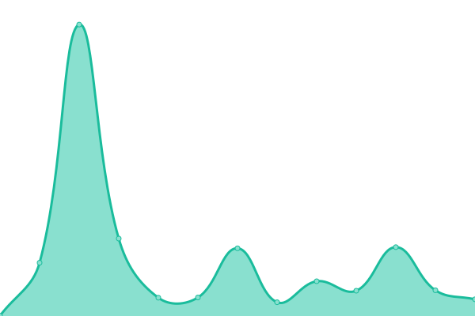

# [📈 Live Status](https://5e-bits.github.io/dnd-uptime): <!--live status--> **🟩 All systems operational**

This repository contains the open-source uptime monitor and status page for [5e-bits](https://github.com/5e-bits), powered by [Upptime](https://github.com/upptime/upptime).

With [Upptime](https://upptime.js.org), you can get your own unlimited and free uptime monitor and status page, powered entirely by a GitHub repository. We use [Issues](https://github.com/5e-bits/dnd-uptime/issues) as incident reports, [Actions](https://github.com/5e-bits/dnd-uptime/actions) as uptime monitors, and [Pages](https://5e-bits.github.io/dnd-uptime) for the status page.

<!--start: status pages-->
<!-- This summary is generated by Upptime (https://github.com/upptime/upptime) -->
<!-- Do not edit this manually, your changes will be overwritten -->
<!-- prettier-ignore -->
| URL | Status | History | Response Time | Uptime |
| --- | ------ | ------- | ------------- | ------ |
|  [Website](https://www.dnd5eapi.co) | 🟩 Up | [website.yml](https://github.com/5e-bits/dnd-uptime/commits/HEAD/history/website.yml) | 

 178ms
     
 | 

<a href="https://5e-bits.github.io/dnd-uptime/history/website">100.00%</a>
    

|  [API](https://www.dnd5eapi.co/api) | 🟩 Up | [api.yml](https://github.com/5e-bits/dnd-uptime/commits/HEAD/history/api.yml) | 

 49ms
     
 | 

<a href="https://5e-bits.github.io/dnd-uptime/history/api">100.00%</a>
    

|  [GraphQL](https://www.dnd5eapi.co/graphql) | 🟩 Up | [graph-ql.yml](https://github.com/5e-bits/dnd-uptime/commits/HEAD/history/graph-ql.yml) | 

 43ms
     
 | 

<a href="https://5e-bits.github.io/dnd-uptime/history/graph-ql">100.00%</a>
    

|  [Ability Scores](https://www.dnd5eapi.co/api/ability-scores) | 🟩 Up | [ability-scores.yml](https://github.com/5e-bits/dnd-uptime/commits/HEAD/history/ability-scores.yml) | 

 46ms
     
 | 

<a href="https://5e-bits.github.io/dnd-uptime/history/ability-scores">100.00%</a>
    

|  [Alignments](https://www.dnd5eapi.co/api/alignments) | 🟩 Up | [alignments.yml](https://github.com/5e-bits/dnd-uptime/commits/HEAD/history/alignments.yml) | 

 45ms
     
 | 

<a href="https://5e-bits.github.io/dnd-uptime/history/alignments">100.00%</a>
    

|  [Backgrounds](https://www.dnd5eapi.co/api/backgrounds) | 🟩 Up | [backgrounds.yml](https://github.com/5e-bits/dnd-uptime/commits/HEAD/history/backgrounds.yml) | 

 326ms
     
 | 

<a href="https://5e-bits.github.io/dnd-uptime/history/backgrounds">100.00%</a>
    

|  [Classes](https://www.dnd5eapi.co/api/classes) | 🟩 Up | [classes.yml](https://github.com/5e-bits/dnd-uptime/commits/HEAD/history/classes.yml) | 

 41ms
     
 | 

<a href="https://5e-bits.github.io/dnd-uptime/history/classes">100.00%</a>
    

|  [Conditions](https://www.dnd5eapi.co/api/conditions) | 🟩 Up | [conditions.yml](https://github.com/5e-bits/dnd-uptime/commits/HEAD/history/conditions.yml) | 

 41ms
     
 | 

<a href="https://5e-bits.github.io/dnd-uptime/history/conditions">100.00%</a>
    

|  [Damage Types](https://www.dnd5eapi.co/api/damage-types) | 🟩 Up | [damage-types.yml](https://github.com/5e-bits/dnd-uptime/commits/HEAD/history/damage-types.yml) | 

 44ms
     
 | 

<a href="https://5e-bits.github.io/dnd-uptime/history/damage-types">100.00%</a>
    

|  [Equipment Categories](https://www.dnd5eapi.co/api/equipment-categories) | 🟩 Up | [equipment-categories.yml](https://github.com/5e-bits/dnd-uptime/commits/HEAD/history/equipment-categories.yml) | 

 45ms
     
 | 

<a href="https://5e-bits.github.io/dnd-uptime/history/equipment-categories">100.00%</a>
    

|  [Equipment](https://www.dnd5eapi.co/api/equipment) | 🟩 Up | [equipment.yml](https://github.com/5e-bits/dnd-uptime/commits/HEAD/history/equipment.yml) | 

 93ms
     
 | 

<a href="https://5e-bits.github.io/dnd-uptime/history/equipment">100.00%</a>
    

|  [Features](https://www.dnd5eapi.co/api/features) | 🟩 Up | [features.yml](https://github.com/5e-bits/dnd-uptime/commits/HEAD/history/features.yml) | 

 96ms
     
 | 

<a href="https://5e-bits.github.io/dnd-uptime/history/features">100.00%</a>
    

|  [Languages](https://www.dnd5eapi.co/api/languages) | 🟩 Up | [languages.yml](https://github.com/5e-bits/dnd-uptime/commits/HEAD/history/languages.yml) | 

 41ms
     
 | 

<a href="https://5e-bits.github.io/dnd-uptime/history/languages">100.00%</a>
    

|  [Magic Schools](https://www.dnd5eapi.co/api/magic-schools) | 🟩 Up | [magic-schools.yml](https://github.com/5e-bits/dnd-uptime/commits/HEAD/history/magic-schools.yml) | 

 41ms
     
 | 

<a href="https://5e-bits.github.io/dnd-uptime/history/magic-schools">100.00%</a>
    

|  [Monsters](https://www.dnd5eapi.co/api/monsters) | 🟩 Up | [monsters.yml](https://github.com/5e-bits/dnd-uptime/commits/HEAD/history/monsters.yml) | 

 73ms
     
 | 

<a href="https://5e-bits.github.io/dnd-uptime/history/monsters">100.00%</a>
    

|  [Proficiencies](https://www.dnd5eapi.co/api/proficiencies) | 🟩 Up | [proficiencies.yml](https://github.com/5e-bits/dnd-uptime/commits/HEAD/history/proficiencies.yml) | 

 58ms
     
 | 

<a href="https://5e-bits.github.io/dnd-uptime/history/proficiencies">100.00%</a>
    

|  [Races](https://www.dnd5eapi.co/api/races) | 🟩 Up | [races.yml](https://github.com/5e-bits/dnd-uptime/commits/HEAD/history/races.yml) | 

 40ms
     
 | 

<a href="https://5e-bits.github.io/dnd-uptime/history/races">100.00%</a>
    

|  [Rules](https://www.dnd5eapi.co/api/rules) | 🟩 Up | [rules.yml](https://github.com/5e-bits/dnd-uptime/commits/HEAD/history/rules.yml) | 

 41ms
     
 | 

<a href="https://5e-bits.github.io/dnd-uptime/history/rules">100.00%</a>
    

|  [Rule Sections](https://www.dnd5eapi.co/api/rule-sections) | 🟩 Up | [rule-sections.yml](https://github.com/5e-bits/dnd-uptime/commits/HEAD/history/rule-sections.yml) | 

 38ms
     
 | 

<a href="https://5e-bits.github.io/dnd-uptime/history/rule-sections">100.00%</a>
    

|  [Skills](https://www.dnd5eapi.co/api/skills) | 🟩 Up | [skills.yml](https://github.com/5e-bits/dnd-uptime/commits/HEAD/history/skills.yml) | 

 43ms
     
 | 

<a href="https://5e-bits.github.io/dnd-uptime/history/skills">100.00%</a>
    

|  [Spells](https://www.dnd5eapi.co/api/spells) | 🟩 Up | [spells.yml](https://github.com/5e-bits/dnd-uptime/commits/HEAD/history/spells.yml) | 

 73ms
     
 | 

<a href="https://5e-bits.github.io/dnd-uptime/history/spells">100.00%</a>
    

|  [Subclasses](https://www.dnd5eapi.co/api/subclasses) | 🟩 Up | [subclasses.yml](https://github.com/5e-bits/dnd-uptime/commits/HEAD/history/subclasses.yml) | 

 44ms
     
 | 

<a href="https://5e-bits.github.io/dnd-uptime/history/subclasses">100.00%</a>
    

|  [Subraces](https://www.dnd5eapi.co/api/subraces) | 🟩 Up | [subraces.yml](https://github.com/5e-bits/dnd-uptime/commits/HEAD/history/subraces.yml) | 

 42ms
     
 | 

<a href="https://5e-bits.github.io/dnd-uptime/history/subraces">100.00%</a>
    

|  [Traits](https://www.dnd5eapi.co/api/traits) | 🟩 Up | [traits.yml](https://github.com/5e-bits/dnd-uptime/commits/HEAD/history/traits.yml) | 

 42ms
     
 | 

<a href="https://5e-bits.github.io/dnd-uptime/history/traits">100.00%</a>
    

|  [Weapon Properties](https://www.dnd5eapi.co/api/weapon-properties) | 🟩 Up | [weapon-properties.yml](https://github.com/5e-bits/dnd-uptime/commits/HEAD/history/weapon-properties.yml) | 

 41ms
     
 | 

<a href="https://5e-bits.github.io/dnd-uptime/history/weapon-properties">100.00%</a>
    

<!--end: status pages-->

[**Visit our status website →**](https://5e-bits.github.io/dnd-uptime)

## 📄 License

- Powered by: [Upptime](https://github.com/upptime/upptime)
- Code: [MIT](./LICENSE) © [5e-bits](https://github.com/5e-bits)
- Data in the `./history` directory: [Open Database License](https://opendatacommons.org/licenses/odbl/1-0/)
