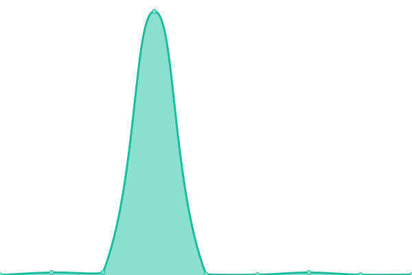
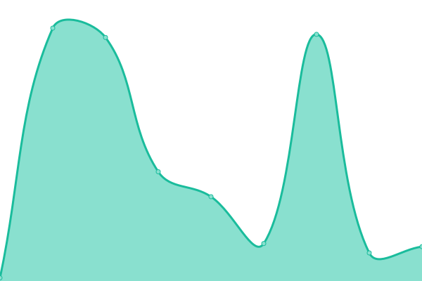
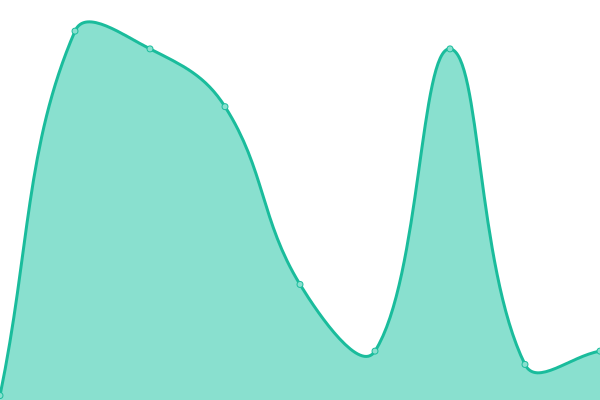
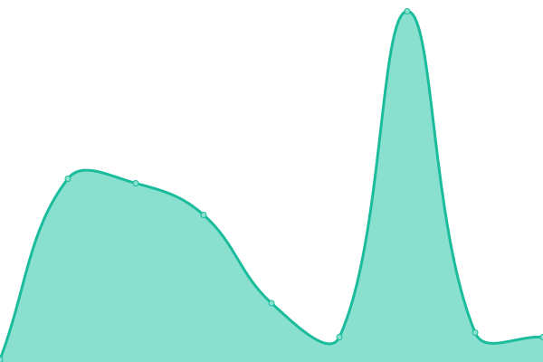
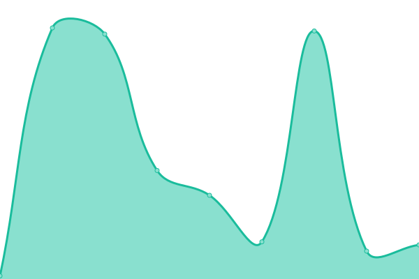
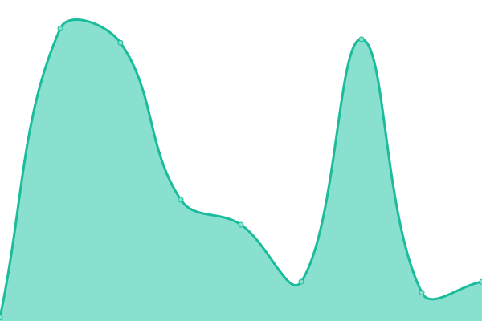

# [📈 Live Status](https://5e-bits.github.io/dnd-uptime): <!--live status--> **🟥 Complete outage**

This repository contains the open-source uptime monitor and status page for [5e-bits](https://github.com/5e-bits), powered by [Upptime](https://github.com/upptime/upptime).

With [Upptime](https://upptime.js.org), you can get your own unlimited and free uptime monitor and status page, powered entirely by a GitHub repository. We use [Issues](https://github.com/5e-bits/dnd-uptime/issues) as incident reports, [Actions](https://github.com/5e-bits/dnd-uptime/actions) as uptime monitors, and [Pages](https://5e-bits.github.io/dnd-uptime) for the status page.

<!--start: status pages-->
<!-- This summary is generated by Upptime (https://github.com/upptime/upptime) -->
<!-- Do not edit this manually, your changes will be overwritten -->
<!-- prettier-ignore -->
| URL | Status | History | Response Time | Uptime |
| --- | ------ | ------- | ------------- | ------ |
|  [Website](https://www.dnd5eapi.co) | 🟥 Down | [website.yml](https://github.com/5e-bits/dnd-uptime/commits/HEAD/history/website.yml) | 

 155ms
     
 | 

<a href="https://5e-bits.github.io/dnd-uptime/history/website">84.00%</a>
    

|  [API (2014 Rules)](https://www.dnd5eapi.co/api/2014) | 🟥 Down | [api-2014-rules.yml](https://github.com/5e-bits/dnd-uptime/commits/HEAD/history/api-2014-rules.yml) | 

 32ms
     
 | 

<a href="https://5e-bits.github.io/dnd-uptime/history/api-2014-rules">84.05%</a>
    

|  [GraphQL (2014 Rules)](https://www.dnd5eapi.co/graphql/2014) | 🟥 Down | [graph-ql-2014-rules.yml](https://github.com/5e-bits/dnd-uptime/commits/HEAD/history/graph-ql-2014-rules.yml) | 

 51ms
     
 | 

<a href="https://5e-bits.github.io/dnd-uptime/history/graph-ql-2014-rules">84.11%</a>
    

|  [Ability Scores (2014 Rules)](https://www.dnd5eapi.co/api/2014/ability-scores) | 🟥 Down | [ability-scores-2014-rules.yml](https://github.com/5e-bits/dnd-uptime/commits/HEAD/history/ability-scores-2014-rules.yml) | 

 32ms
     
 | 

<a href="https://5e-bits.github.io/dnd-uptime/history/ability-scores-2014-rules">84.17%</a>
    

|  [Alignments (2014 Rules)](https://www.dnd5eapi.co/api/2014/alignments) | 🟥 Down | [alignments-2014-rules.yml](https://github.com/5e-bits/dnd-uptime/commits/HEAD/history/alignments-2014-rules.yml) | 

 33ms
     
 | 

<a href="https://5e-bits.github.io/dnd-uptime/history/alignments-2014-rules">84.37%</a>
    

|  [Backgrounds (2014 Rules)](https://www.dnd5eapi.co/api/2014/backgrounds) | 🟥 Down | [backgrounds-2014-rules.yml](https://github.com/5e-bits/dnd-uptime/commits/HEAD/history/backgrounds-2014-rules.yml) | 

 31ms
     
 | 

<a href="https://5e-bits.github.io/dnd-uptime/history/backgrounds-2014-rules">84.42%</a>
    

|  [Classes (2014 Rules)](https://www.dnd5eapi.co/api/2014/classes) | 🟥 Down | [classes-2014-rules.yml](https://github.com/5e-bits/dnd-uptime/commits/HEAD/history/classes-2014-rules.yml) | 

 352ms
     
 | 

<a href="https://5e-bits.github.io/dnd-uptime/history/classes-2014-rules">84.47%</a>
    

|  [Conditions (2014 Rules)](https://www.dnd5eapi.co/api/2014/conditions) | 🟥 Down | [conditions-2014-rules.yml](https://github.com/5e-bits/dnd-uptime/commits/HEAD/history/conditions-2014-rules.yml) | 

 35ms
     
 | 

<a href="https://5e-bits.github.io/dnd-uptime/history/conditions-2014-rules">84.52%</a>
    

|  [Damage Types (2014 Rules)](https://www.dnd5eapi.co/api/2014/damage-types) | 🟥 Down | [damage-types-2014-rules.yml](https://github.com/5e-bits/dnd-uptime/commits/HEAD/history/damage-types-2014-rules.yml) | 

 34ms
     
 | 

<a href="https://5e-bits.github.io/dnd-uptime/history/damage-types-2014-rules">84.57%</a>
    

|  [Equipment Categories (2014 Rules)](https://www.dnd5eapi.co/api/2014/equipment-categories) | 🟥 Down | [equipment-categories-2014-rules.yml](https://github.com/5e-bits/dnd-uptime/commits/HEAD/history/equipment-categories-2014-rules.yml) | 

 42ms
     
 | 

<a href="https://5e-bits.github.io/dnd-uptime/history/equipment-categories-2014-rules">84.76%</a>
    

|  [Equipment (2014 Rules)](https://www.dnd5eapi.co/api/2014/equipment) | 🟥 Down | [equipment-2014-rules.yml](https://github.com/5e-bits/dnd-uptime/commits/HEAD/history/equipment-2014-rules.yml) | 

 120ms
     
 | 

<a href="https://5e-bits.github.io/dnd-uptime/history/equipment-2014-rules">84.81%</a>
    

|  [Features (2014 Rules)](https://www.dnd5eapi.co/api/2014/features) | 🟥 Down | [features-2014-rules.yml](https://github.com/5e-bits/dnd-uptime/commits/HEAD/history/features-2014-rules.yml) | 

 217ms
     
 | 

<a href="https://5e-bits.github.io/dnd-uptime/history/features-2014-rules">85.00%</a>
    

|  [Languages (2014 Rules)](https://www.dnd5eapi.co/api/2014/languages) | 🟥 Down | [languages-2014-rules.yml](https://github.com/5e-bits/dnd-uptime/commits/HEAD/history/languages-2014-rules.yml) | 

 34ms
     
 | 

<a href="https://5e-bits.github.io/dnd-uptime/history/languages-2014-rules">85.04%</a>
    

|  [Magic Schools (2014 Rules)](https://www.dnd5eapi.co/api/2014/magic-schools) | 🟥 Down | [magic-schools-2014-rules.yml](https://github.com/5e-bits/dnd-uptime/commits/HEAD/history/magic-schools-2014-rules.yml) | 

 34ms
     
 | 

<a href="https://5e-bits.github.io/dnd-uptime/history/magic-schools-2014-rules">85.08%</a>
    

|  [Monsters (2014 Rules)](https://www.dnd5eapi.co/api/2014/monsters) | 🟥 Down | [monsters-2014-rules.yml](https://github.com/5e-bits/dnd-uptime/commits/HEAD/history/monsters-2014-rules.yml) | 

 47ms
     
 | 

<a href="https://5e-bits.github.io/dnd-uptime/history/monsters-2014-rules">85.13%</a>
    

|  [Proficiencies (2014 Rules)](https://www.dnd5eapi.co/api/2014/proficiencies) | 🟥 Down | [proficiencies-2014-rules.yml](https://github.com/5e-bits/dnd-uptime/commits/HEAD/history/proficiencies-2014-rules.yml) | 

 63ms
     
 | 

<a href="https://5e-bits.github.io/dnd-uptime/history/proficiencies-2014-rules">85.31%</a>
    

|  [Races (2014 Rules)](https://www.dnd5eapi.co/api/2014/races) | 🟥 Down | [races-2014-rules.yml](https://github.com/5e-bits/dnd-uptime/commits/HEAD/history/races-2014-rules.yml) | 

 125ms
     
 | 

<a href="https://5e-bits.github.io/dnd-uptime/history/races-2014-rules">85.35%</a>
    

|  [Rules (2014 Rules)](https://www.dnd5eapi.co/api/2014/rules) | 🟥 Down | [rules-2014-rules.yml](https://github.com/5e-bits/dnd-uptime/commits/HEAD/history/rules-2014-rules.yml) | 

 27ms
     
 | 

<a href="https://5e-bits.github.io/dnd-uptime/history/rules-2014-rules">85.39%</a>
    

|  [Rule Sections (2014 Rules)](https://www.dnd5eapi.co/api/2014/rule-sections) | 🟥 Down | [rule-sections-2014-rules.yml](https://github.com/5e-bits/dnd-uptime/commits/HEAD/history/rule-sections-2014-rules.yml) | 

 32ms
     
 | 

<a href="https://5e-bits.github.io/dnd-uptime/history/rule-sections-2014-rules">88.18%</a>
    

|  [Skills (2014 Rules)](https://www.dnd5eapi.co/api/2014/skills) | 🟥 Down | [skills-2014-rules.yml](https://github.com/5e-bits/dnd-uptime/commits/HEAD/history/skills-2014-rules.yml) | 

 34ms
     
 | 

<a href="https://5e-bits.github.io/dnd-uptime/history/skills-2014-rules">85.46%</a>
    

|  [Spells (2014 Rules)](https://www.dnd5eapi.co/api/2014/spells) | 🟥 Down | [spells-2014-rules.yml](https://github.com/5e-bits/dnd-uptime/commits/HEAD/history/spells-2014-rules.yml) | 

 48ms
     
 | 

<a href="https://5e-bits.github.io/dnd-uptime/history/spells-2014-rules">85.50%</a>
    

|  [Subclasses (2014 Rules)](https://www.dnd5eapi.co/api/2014/subclasses) | 🟥 Down | [subclasses-2014-rules.yml](https://github.com/5e-bits/dnd-uptime/commits/HEAD/history/subclasses-2014-rules.yml) | 

 33ms
     
 | 

<a href="https://5e-bits.github.io/dnd-uptime/history/subclasses-2014-rules">85.68%</a>
    

|  [Subraces (2014 Rules)](https://www.dnd5eapi.co/api/2014/subraces) | 🟥 Down | [subraces-2014-rules.yml](https://github.com/5e-bits/dnd-uptime/commits/HEAD/history/subraces-2014-rules.yml) | 

 39ms
     
 | 

<a href="https://5e-bits.github.io/dnd-uptime/history/subraces-2014-rules">88.79%</a>
    

|  [Traits (2014 Rules)](https://www.dnd5eapi.co/api/2014/traits) | 🟥 Down | [traits-2014-rules.yml](https://github.com/5e-bits/dnd-uptime/commits/HEAD/history/traits-2014-rules.yml) | 

 41ms
     
 | 

<a href="https://5e-bits.github.io/dnd-uptime/history/traits-2014-rules">86.03%</a>
    

|  [Weapon Properties (2014 Rules)](https://www.dnd5eapi.co/api/2014/weapon-properties) | 🟥 Down | [weapon-properties-2014-rules.yml](https://github.com/5e-bits/dnd-uptime/commits/HEAD/history/weapon-properties-2014-rules.yml) | 

 33ms
     
 | 

<a href="https://5e-bits.github.io/dnd-uptime/history/weapon-properties-2014-rules">86.05%</a>
    

<!--end: status pages-->

[**Visit our status website →**](https://5e-bits.github.io/dnd-uptime)

## 📄 License

- Powered by: [Upptime](https://github.com/upptime/upptime)
- Code: [MIT](./LICENSE) © [5e-bits](https://github.com/5e-bits)
- Data in the `./history` directory: [Open Database License](https://opendatacommons.org/licenses/odbl/1-0/)
